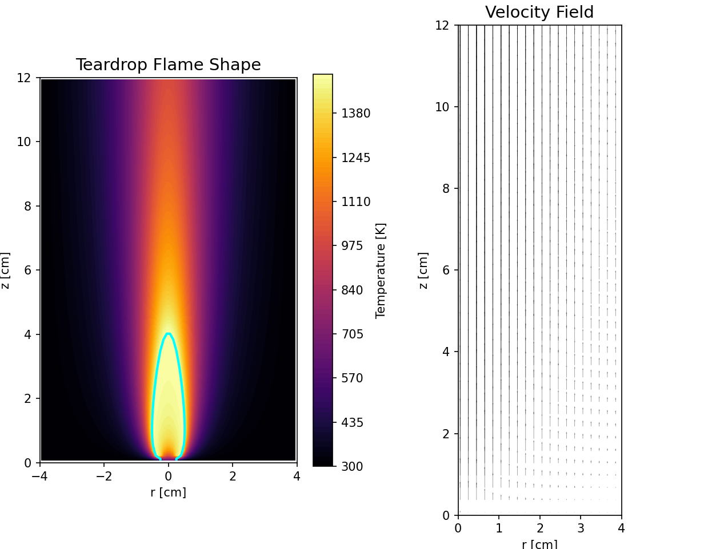

# ロウソクの炎の2次元数値解析

> 流体力学と燃焼現象を支配する偏微分方程式（PDE）を有限差分法で解き、炎の形状をシミュレーションするプログラム

## Demo / Visuals



## Overview

ロウソクの炎が形成する特徴的な「ティアドロップ型」の形状と、周囲の空気の対流（流速場）をシミュレーションするPythonプログラムです。外部の重い流体解析（CFD）ライブラリを使用せず、物理現象を支配する偏微分方程式をNumPyを用いた配列演算のみでスクラッチ実装しています。

※本プロジェクトは大学4年生の際にローカル環境で開発し、ポートフォリオとして本リポジトリにアーカイブしたものです。

## Motivation

学部4年生の際の研究課題で炎の燃える様子を数学的に論ぜよというものがあったので、身近なロウソクの燃焼の様子を選びPythonで数値解析を行いました。アルゴリズムの構築から数値的安定性の確保まで、低レイヤーの計算処理を深く理解することを目指しました。

## Tech Stack

* **Language:** Python
* **Libraries:** NumPy (数値計算・ベクトル化処理) / Matplotlib (可視化)
* **Mathematical Models:** ナビエ・ストークス方程式 / 移流拡散方程式 / ブシネスク近似（浮力モデル） / 混合分率（Burke-Schumann近似）

## Key Features & Technical Challenges

### 主な機能
* ロウソクの芯から発生する燃料ガスと、周囲の空気（酸素）の混合による燃焼・発熱シミュレーション
* 温度勾配に起因する浮力と、それに伴う空気の対流（流速場）の2次元可視化
* 軸対称性を利用した、Matplotlibによる直感的なティアドロップ形状の描画

### 技術的な工夫・解決した課題
* **課題1: Pythonの実行速度のボトルネック**
  * 空間グリッド（Nz×Nr）の各点における空間微分（移流・拡散）を2重の `for` ループで記述すると、Pythonの仕様上、15,000ステップの計算に膨大な時間がかかってしまう懸念があった。
  * **解決策:** NumPyのスライス機能を応用したヘルパー関数（`shift_up`, `shift_down` 等）を作成し、行列全体のズレを利用して差分を計算する**完全なベクトル化処理**を実装。計算速度を向上させた。
* **課題2: 陽解法における数値的発散**
  * 微分方程式を陽解法（前進オイラー法）で解いているため、時間刻み幅（dt）や流速の急激な変化によって計算が発散しやすかった。
  * **解決策:** 燃焼の複雑な化学反応を解く代わりに、燃料と酸化剤の割合を示す「混合分率（Mixture Fraction: Z）」を用いて温度場を代数的に導出するアプローチを採用。さらに、各ステップで流速（u, v）と混合分率（Z）に物理的妥当な範囲でのクリッピング処理（`np.clip`）を施すことで、シミュレーションの安定性を確保した。

## Installation & Usage

### 前提条件
NumPy および Matplotlib がインストールされているPython環境が必要です。

### 実行手順
1. 本リポジトリの `code.py` のコードをすべてコピーします。
2. お好みのエディタ（VS Code等）に貼り付けます。
3. 以下の必須ライブラリがインストールされていることを確認します。
   ```bash
   pip install numpy matplotlib
   ```
4. そのまま実行（Run）してください。コンソールに進捗が表示され、計算完了後に自動でグラフがポップアップ描画されます。
